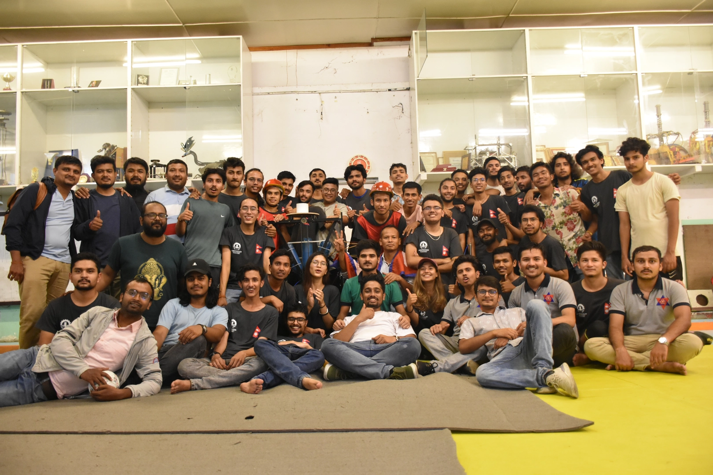

ABU Robocon 2022 was hosted by India. Due to the COVID-19 pandemic, the onsite contest was not held. The participants instead did a demonstration run of their robots at their local universities as a one-player game.

The theme of the game was called "lagori". The game took inspiration from the traditional game of lagori. Two teams engaged in the competition, each tasked with designing two robots. They alternated roles as the seeker and hitter throughout the game.

The seeker's first robot executed the initial move by skillfully breaking a carefully arranged pile of stones using three small balls. Following this, the seeker's second robot took the stage, diligently rebuilding the pile of stones while balancing a ball on its head. The challenge intensified as the hitter's robot entered the arena, strategically attempting to dislodge the ball perched on the seeker's robot.

The rounds were gripping, concluding immediately once the hitter's robot successfully knocked off the ball from the seeker's second robot's head. Points were tallied based on the number of stones displaced and subsequently rebuilt by the teams. The team with the higher score at the end of the intense competition was declared the triumphant winner of ABU Robocon 2022.





