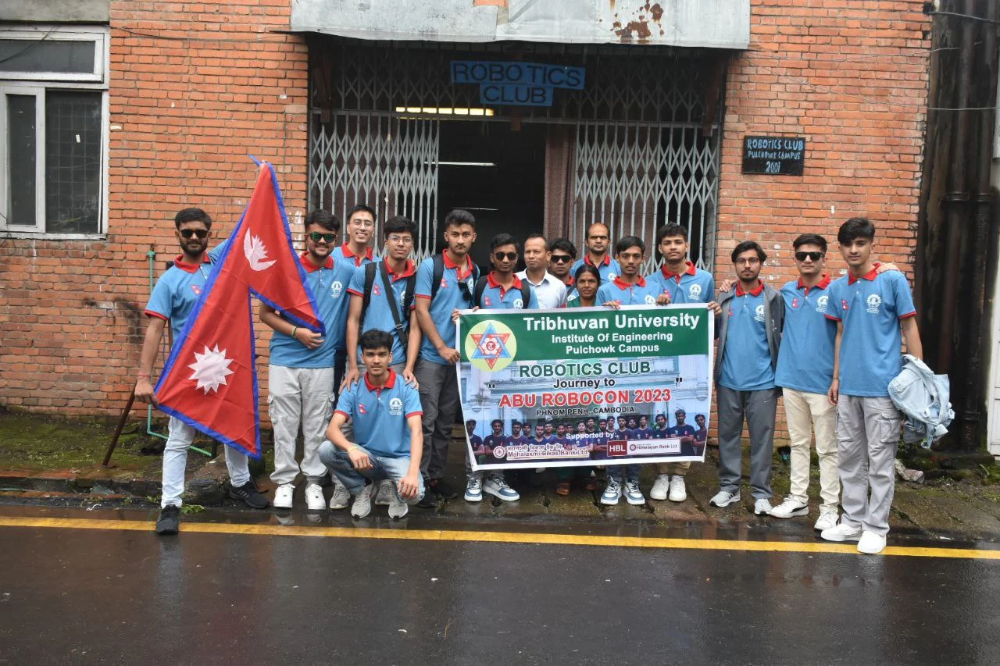

Robocon 2023 was very special as it was the first Robocon to be held physically in the onsite location after the pandemic, in Phnom Penh, Cambodia. 

The theme of the tournament was "Casting Flowers Over Angkor Wat".Angkor Wat in Cambodia is well known as a breath-takingly beautiful temple complex which is enlisted the UNESCO world heritage site. The actual competition is "Ring Toss Game’ using blue and red rings made of rubber hoses instead of flowers

 The game was played by two robots in each team, namely the rabbit robot and the elephant robot. In Cambodian fables, among many animal characters, rabbit is often featured as the symbol of wisdom while elephant is strong and has a gentle nature. The two robots were tasked to toss the rings in the poles of their respective sides and the centre area. Only the rabbit robot was alowed to enter the centre area, but both robots could toss the ring in any poles in the game field. 